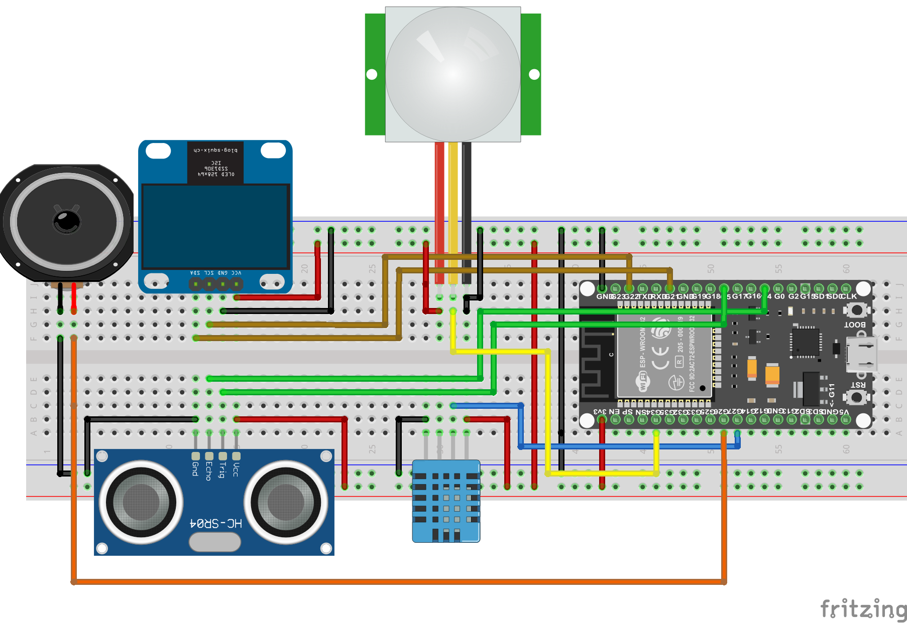
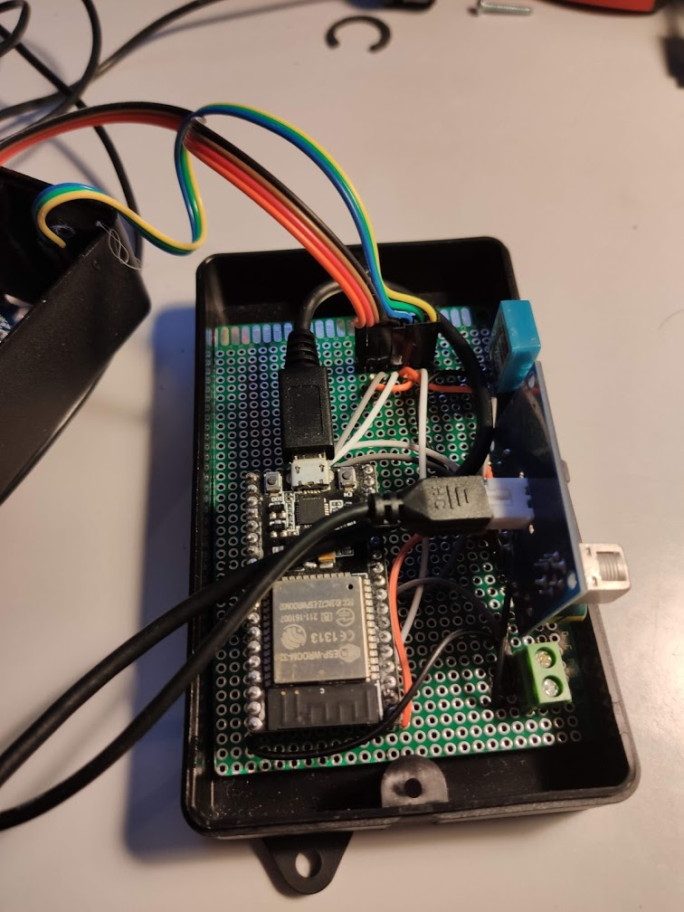
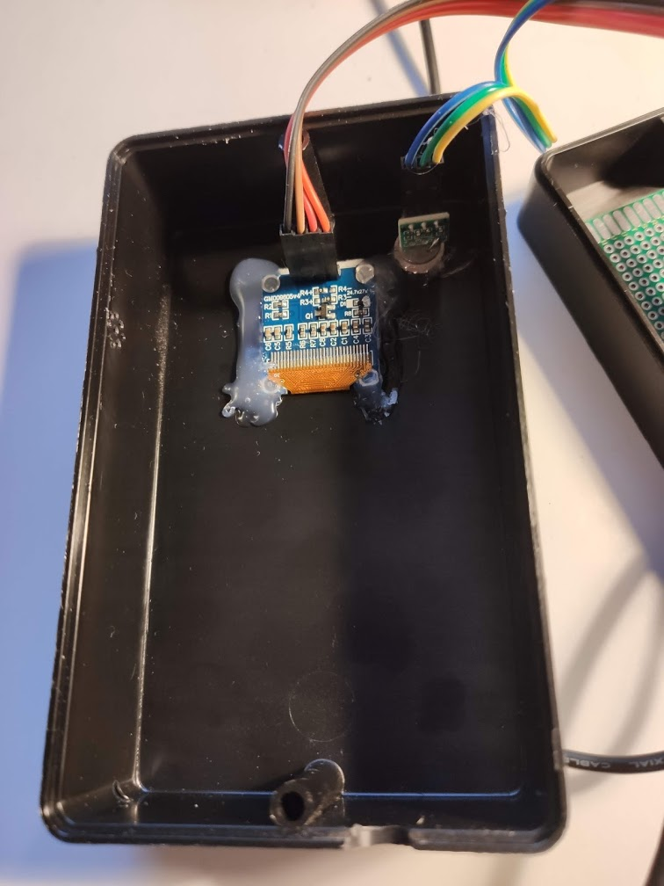
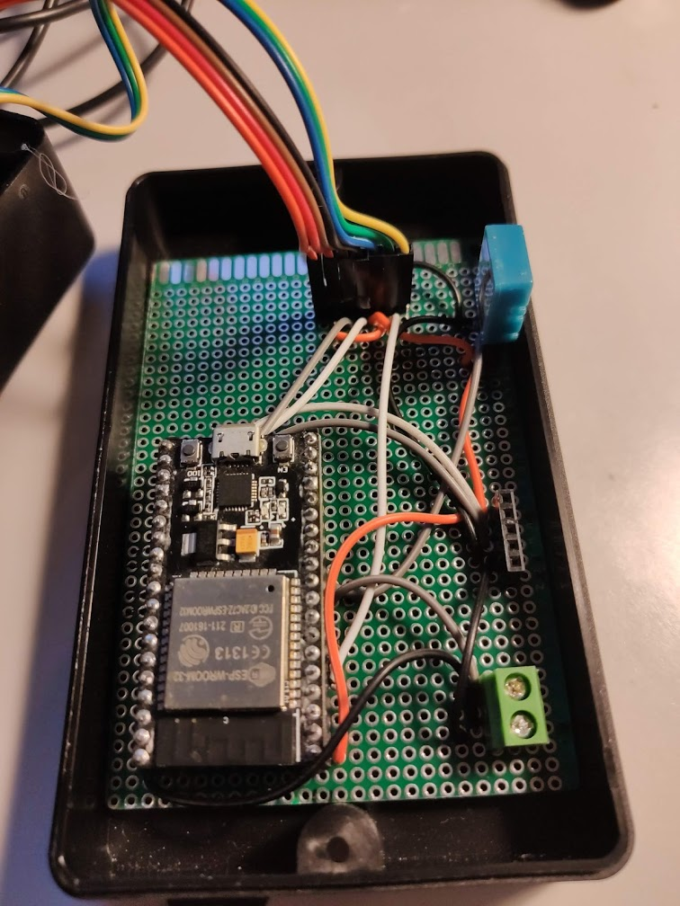
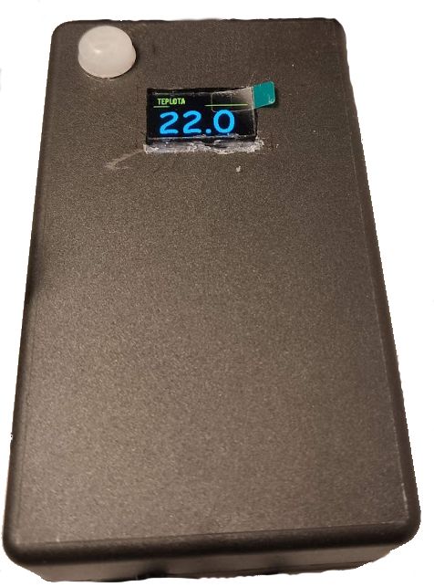

# depth-gauge-v2

Jednoduchy "udelatko" na mereni hladiny v nadrzi. Hlavni vlastnosti jsou:

 * Mereni kolik je litru vody v nadrzi
 * Mereni jak vysoko je hladina
 * Pri poklesu hladiny pod minimalni hranici, spustit alarm (kvuli cerpadlu)
 * Mereni teploty a vlhkosti
 * Stavovy display, ktery zobrazuje informace, ale pouze pokud se u u neho nachazi clovek (zaznamena pohyb)
 * Posila zmerene data na cloud pres protokol MQTT (do vlastni instalace ThingsBoard, lze jednoduse predelat na Home Assistant)

Projekt je zalozen na platformne ESPHome, ktera se na tento typ projektu vice nez hodi. A velmi zjednodusuje praci. 

## Soupis soucastek 

 | Nazev | Aliexpress | Orientacni cena |
 |-------|------------|-----------------|
 | ESP32 | https://www.aliexpress.com/item/32996463686.html | 95 Kc |
 | JSN-SR04T | https://www.aliexpress.com/item/32976459008.html | 94 Kc |
 | DHT11 | https://www.aliexpress.com/item/32802050018.html | 15 Kc |
 | 0.96 inch OLED  | https://www.aliexpress.com/item/32902463963.html | 46 Kc |
 | AM312 | https://www.aliexpress.com/item/32987968997.html | 30 Kc |
 | Speekr | https://www.aliexpress.com/item/33037641624.html | 12 Kc |
 | PCB | https://www.aliexpress.com/item/32512619349.html | 50 kc |
 | | Celkem | ~ 350 kc |

(Odkazy taky nejsou zaruceny, pri sestavovani jsme pouzival i soucastky ze "supliku" )
(Ceny jsou obcas lepsi na eBay, a ceny jsou brany v nehezkem kurzu )

## Schema zapojeni

## Fotky z realizace 

